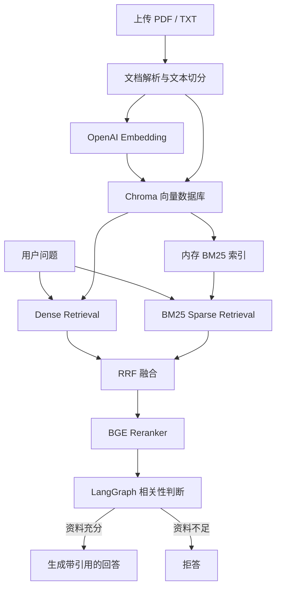

# RAG FastAPI

一个基于 FastAPI、LangChain、LangGraph、Chroma、BM25 和 BGE Reranker 构建的知识库问答后端。

系统支持 PDF/TXT 文档管理、混合检索、结果重排、知识库拒答、答案引用和自动化评测。

## 项目特点

- 支持 PDF、TXT 文档上传、解析和切分
- 使用 SHA-256 根据文件内容去重
- 使用 Chroma 完成语义向量检索
- 使用 BM25 和 jieba 完成中文关键词检索
- 使用 Reciprocal Rank Fusion（RRF）融合两路检索结果
- 使用 BGE CrossEncoder 对候选文本块重新排序
- 使用 LangGraph 编排检索、相关性判断、回答生成和拒答
- 回答附带文件名、页码和文本预览
- 知识库不能支持回答时返回固定拒答，并清空引用来源
- 支持文档列表查询和完整删除
- 包含单元测试与 100 条问题的自动化评测集

## 系统架构



完整问答流程：

```text
用户问题
  → Chroma Dense 检索
  → BM25 Sparse 检索
  → RRF 融合
  → BGE Reranker 重排
  → LangGraph 判断资料是否足以回答
  → 生成回答或拒答
  → 返回答案与来源
```

## 为什么使用混合检索

单独使用向量检索，适合处理语义相近的问题，但对于以下内容可能不够稳定：

- 产品型号
- 邮箱地址
- 电话号码
- 错误代码
- 专有名词
- 精确数字

BM25 更擅长精确词语匹配，因此本项目同时执行 Dense Retrieval 和 BM25 Retrieval，再通过 RRF 融合排序。

RRF 不直接比较两种检索器的原始分数，而是根据文档在各自结果中的排名计算融合分数：

```text
score(document) = Σ 1 / (k + rank)
```

融合结果随后交给 BGE Reranker，使用问题和文本块的联合相关性进一步排序。

## 技术栈

| 类型 | 技术 |
|---|---|
| Web 框架 | FastAPI |
| RAG 组件 | LangChain |
| 工作流编排 | LangGraph |
| 向量数据库 | Chroma |
| 向量模型 | OpenAI Embeddings |
| 关键词检索 | BM25、jieba |
| 重排模型 | BAAI/bge-reranker-v2-m3 |
| 语言模型 | OpenAI Chat Model |
| 关系数据库 | SQLite、SQLAlchemy |
| 数据验证 | Pydantic |
| 自动测试 | Pytest |
| 代码检查 | Ruff |
| 自动评测 | pandas、httpx |

## 项目结构

```text
rag-fastapi/
├── app/
│   ├── api/
│   │   └── routes/
│   │       ├── chat.py
│   │       └── documents.py
│   ├── core/
│   │   └── config.py
│   ├── db/
│   │   ├── database.py
│   │   └── models.py
│   ├── services/
│   │   ├── bm25_store.py
│   │   ├── file_storage.py
│   │   ├── hybrid_retriever.py
│   │   ├── ingestion.py
│   │   ├── rag.py
│   │   ├── reranker.py
│   │   └── vector_store.py
│   ├── main.py
│   └── schemas.py
├── eval/
│   ├── data/
│   └── results/
├── scripts/
│   └── evaluate_rag.py
├── storage/
│   ├── chroma/
│   └── uploads/
├── tests/
├── .env.example
├── pytest.ini
├── pyproject.toml
├── requirements.txt
├── requirements-dev.txt
└── requirements-lock.txt
```

## 环境要求

推荐环境：

- Python 3.12
- Windows、Linux 或 macOS
- 有效的 OpenAI API Key
- 建议至少保留 4GB 可用磁盘空间
- 使用 CPU 运行 reranker 时，建议至少具备 8GB 内存

`BAAI/bge-reranker-v2-m3` 首次运行时需要从 Hugging Face 下载模型，模型缓存会占用约 2GB 至 3GB 空间。

## 安装

### 1. 创建虚拟环境

Windows PowerShell：

```powershell
python -m venv .venv
.\.venv\Scripts\Activate.ps1
```

Linux 或 macOS：

```bash
python -m venv .venv
source .venv/bin/activate
```

### 2. 安装项目依赖

```bash
python -m pip install --upgrade pip
pip install -r requirements.txt
```

如果需要运行测试、评测和代码检查：

```bash
pip install -r requirements-dev.txt
```

## 配置环境变量

复制环境变量示例：

Windows PowerShell：

```powershell
Copy-Item .env.example .env
```

Linux 或 macOS：

```bash
cp .env.example .env
```

编辑 `.env`：

```env
OPENAI_API_KEY=your-openai-api-key

OPENAI_CHAT_MODEL=gpt-5.4-mini
OPENAI_EMBEDDING_MODEL=text-embedding-3-small

CHROMA_COLLECTION=rag_knowledge_base
CHROMA_DIR=storage/chroma
UPLOAD_DIR=storage/uploads

CHUNK_SIZE=800
CHUNK_OVERLAP=120

TOP_K=4
DENSE_CANDIDATE_K=20
BM25_CANDIDATE_K=20
FUSION_CANDIDATE_K=20
RRF_K=60

RERANKER_MODEL=BAAI/bge-reranker-v2-m3
RERANKER_BATCH_SIZE=8
RERANKER_DEVICE=cpu
RERANKER_MAX_LENGTH=512

MAX_UPLOAD_SIZE_MB=10
```

如果当前 PyTorch 安装包不支持 CUDA，必须使用：

```env
RERANKER_DEVICE=cpu
```

只有安装了支持 CUDA 的 PyTorch，并且机器具有可用的 NVIDIA GPU 时，才能配置：

```env
RERANKER_DEVICE=cuda
```

不要把包含真实 API Key 的 `.env` 提交到 Git。

## 启动服务

在项目根目录运行：

```bash
uvicorn app.main:app --reload
```

服务启动后访问：

- Swagger API 文档：<http://127.0.0.1:8000/docs>
- 健康检查：<http://127.0.0.1:8000/health>

健康检查示例：

```json
{
  "status": "ok",
  "service": "RAG FastAPI Backend"
}
```

## API 接口

### 上传文档

```http
POST /api/v1/documents/upload
Content-Type: multipart/form-data
```

表单字段：

| 字段 | 类型 | 说明 |
|---|---|---|
| file | File | PDF 或 UTF-8 编码的 TXT 文件 |

限制：

- 只支持 PDF 和 TXT
- 默认最大文件大小为 10MB
- 根据文件内容的 SHA-256 哈希判断是否重复
- 内容相同但文件名不同的文件仍会被识别为重复文件

成功响应示例：

```json
{
  "document_id": "b699abe14c53476187c660a7568e0eb3",
  "file_name": "demo_knowledge.txt",
  "document_count": 1,
  "chunk_count": 4,
  "message": "文件已成功加入知识库"
}
```

### 查询文档列表

```http
GET /api/v1/documents
```

### 删除文档

```http
DELETE /api/v1/documents/{document_id}
```

删除操作会同时清理：

- SQLite 中的文档记录
- 上传文件
- Chroma 中对应的文本块和向量
- BM25 内存索引缓存

BM25 索引会在下一次检索时从 Chroma 自动重建。

### 知识库问答

```http
POST /api/v1/chat
Content-Type: application/json
```

请求示例：

```json
{
  "question": "系统如何判断上传文件是否重复？",
  "top_k": 4
}
```

成功回答示例：

```json
{
  "answer": "系统会计算文件内容的 SHA-256 哈希值，并在数据库中查找是否存在相同哈希值的记录。[1]",
  "sources": [
    {
      "index": 1,
      "document_id": "b699abe14c53476187c660a7568e0eb3",
      "file_name": "demo_knowledge.txt",
      "page": null,
      "content_preview": "文件上传时，系统会计算文件内容的 SHA-256 哈希值..."
    }
  ]
}
```

资料不足时返回：

```json
{
  "answer": "根据当前知识库无法确定。",
  "sources": []
}
```

拒答时不返回引用，避免无关资料被误认为答案依据。

## BM25 索引设计

Chroma 是文本块的唯一持久化数据源，项目不会另外保存一份 BM25 索引文件。

BM25 索引的生命周期如下：

1. 首次执行关键词检索时，从 Chroma 读取全部文本块。
2. 使用 jieba 对中文、英文和数字进行分词。
3. 在应用内存中构建 BM25 索引。
4. 上传或删除文档后，将索引标记为失效。
5. 下一次查询时自动从 Chroma 重建。

这种设计避免了 Chroma 与 BM25 两份持久化数据不一致的问题。

索引重建过程使用锁进行保护，防止多个请求同时重建。查询结果全部为零时返回空列表，不会任意返回无关文档。

## LangGraph 工作流

问答流程包含四个节点：

```text
retrieve
   ↓
grade_relevance
   ├── 资料充分 → generate_answer
   └── 资料不足 → refuse_answer
```

各节点职责：

- `retrieve`：执行 Dense、BM25、RRF 和 reranker
- `grade_relevance`：判断资料是否直接、完整地支持回答
- `generate_answer`：根据资料生成带编号引用的答案
- `refuse_answer`：返回固定拒答并清空来源

生成节点还包含最后一道拒答保护：如果模型生成的答案实际表达“无法确定”，系统会统一转换成固定拒答格式，并移除来源。

## 运行测试

安装开发依赖后执行：

```bash
python -m pytest
```

只运行 RAG 工作流测试：

```bash
python -m pytest tests/test_rag_graph.py -v
```

运行代码检查：

```bash
ruff check .
```

运行格式检查：

```bash
ruff format --check .
```

测试覆盖的主要场景包括：

- 文件上传、格式和大小校验
- 文件哈希去重
- 文档解析和向量入库
- Chroma 文本块删除
- BM25 索引构建、失效和重建
- Dense 与 BM25 并行检索
- RRF 融合和结果去重
- reranker 排序
- LangGraph 生成和拒答分支
- 来源格式化
- API 请求和响应

## 自动化评测

启动 API 服务后运行默认评测集：

```bash
python scripts/evaluate_rag.py
```

运行扩充后的 100 条评测集：

```bash
python scripts/evaluate_rag.py --dataset eval/data/questions_expanded.csv
```

覆盖默认 `top_k`：

```bash
python scripts/evaluate_rag.py \
  --dataset eval/data/questions_expanded.csv \
  --top-k 4
```

评测脚本会检查：

- 应回答问题是否生成了答案
- 预期关键词是否全部出现
- 预期来源文件是否被引用
- 不应回答的问题是否正确拒答
- 拒答时是否清空来源
- 单次请求延迟
- 请求是否发生异常

结果会写入：

```text
eval/results/
```

## 当前评测结果

当前已验证的扩充评测集包含 100 条问题：

| 指标 | 结果 |
|---|---:|
| 问题总数 | 100 |
| 总体通过率 | 99.00% |
| 可回答问题通过率 | 98.59% |
| 不可回答问题拒答准确率 | 100.00% |
| 平均请求延迟 | 4129.75 ms |
| 请求错误数 | 0 |

评测集覆盖：

- 精确事实查询
- 产品型号和编号
- 电话、邮箱和日期
- 中文语义改写
- 多条件问题
- 相似主题干扰
- 对象或范围不一致
- 知识库未提供的信息
- 诱导模型编造的问题

当前结果文件：

```text
eval/results/evaluation_20260810_114612.csv
eval/results/evaluation_20260810_114612_summary.csv
```

评测结果会受到模型版本、网络延迟、运行设备和知识库内容影响。

## 关键设计取舍

### 为什么不只使用向量检索

向量检索擅长语义匹配，但不一定稳定命中产品型号、邮箱、编号等精确文本。BM25 可以弥补这一不足。

### 为什么使用 RRF

Dense 和 BM25 的原始分数不在同一个尺度上，不能直接相加。RRF 只依赖排名，能够稳定融合不同检索器的结果。

### 为什么还需要 reranker

Dense 和 BM25 主要负责扩大召回率，reranker 联合分析问题和候选文本，可以进一步提高最终排序质量。

### 为什么增加相关性判断

检索到主题相似的文本不代表资料能够回答问题。相关性节点负责判断资料是否包含问题要求的具体事实，降低幻觉和错误引用风险。

### 为什么拒答时清空来源

如果资料不足却仍返回来源，用户可能把无关文档误认为答案依据。因此拒答响应必须使用空的 `sources`。

## 已知限制

- 当前只支持单轮问答，不保存对话历史
- BM25 索引保存在单个应用进程的内存中
- 多进程部署时，每个进程会维护自己的 BM25 索引
- 文档解析和向量化在请求线程中同步完成
- 大文件入库尚未使用后台任务队列
- CPU 运行大型 reranker 时延迟较高
- 当前未实现用户认证、权限隔离和限流
- 当前评测集属于项目级离线评测，不能代表所有真实业务场景

## 后续优化方向

- 使用后台任务处理大型文档入库
- 增加用户认证与知识库权限隔离
- 增加查询缓存和模型服务监控
- 使用 GPU 或独立推理服务部署 reranker
- 增加多轮对话和查询改写
- 增加真实业务数据上的 Recall@K、MRR 和 nDCG 评测
- 支持更多文件格式和 OCR